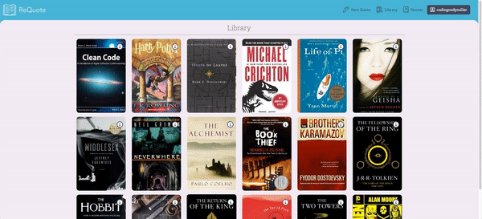

# ReQuote

A personal library to collect and share your favorite quotes from your favorite books.

## Why I Built This

I have always been an avid reader, and I love taking note of passages that resonate with me so I can go back to them in the future. Traditionally, I would use a highlighter in my books for this, but after a few years of doing this, I discovered a problem: highlighter fades over time, and in some of my older books, my highlighted passages were all but invisible. As a programmer, I saw a need for an application focused solely on saving quotes from books in a grand list that can be filtered, searched through, and reorganized for easy perusal and sharing. ReQuote is an application built to address this need!

## Technologies Used

- React.js
- React Router
- Webpack
- Bootstrap 5
- Node.js
- PostgreSQL
- HTML5
- CSS3
- Tesseract.js
- OAuth 2.0
- Open ID Connect
- Dokku

## Live Demo

Try the application live at [https://requote-app.com](https://requote-app.com)

## Features

- User can save a quote.
- User can transcribe quote from an image using Optical Character Recognition.
- User can view all saved quotes.
- User can view all books with saved quotes.
- User can filter quotes by search term.
- User can sort quotes by length, page number, or date created.
- User can view details of a single book.
- User can share quote via hyperlink.

## Preview

#### Landing Page and Book Details


#### Saving a Quote


#### Quotes Dashboard and Library


## Development

### System Requirements

- Node.js 18 or higher
- NPM 8 or higher
- PostgreSQL 14 or higher

### Getting Started

1. Clone the repository.

    ```shell
    git clone https://github.com/codingcodymiller/requote
    cd requote
    ```

1. Install all dependencies with NPM.

    ```shell
    npm ci
    ```

1. Import the example database to MongoDB.

    ```shell
    npm run db:import
    ```

1. Start the project. Once started you can view the application by opening http://localhost:3000 in your browser.

    ```shell
    npm run dev
    ```
